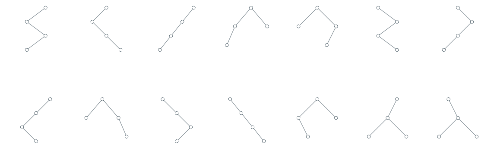
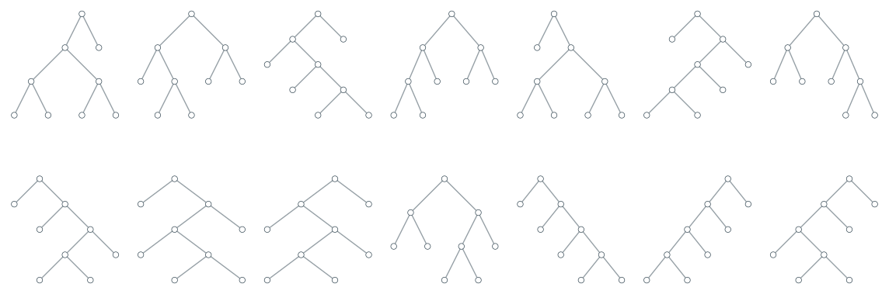
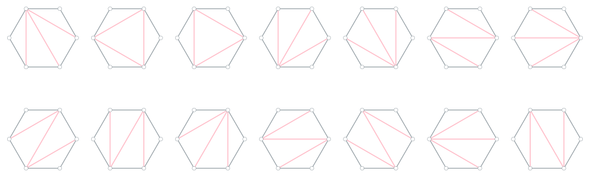
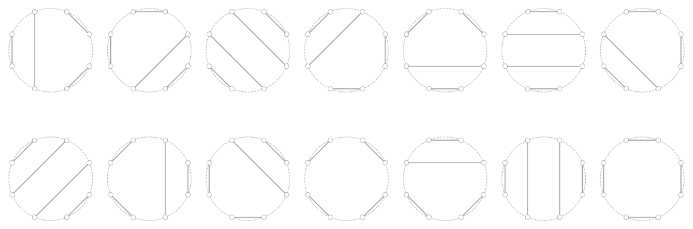
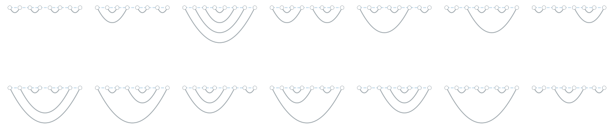
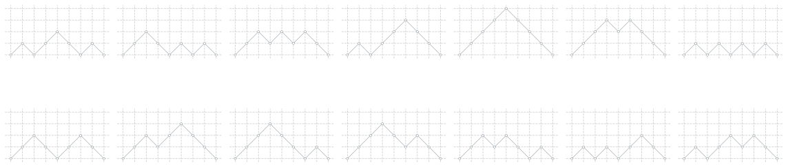
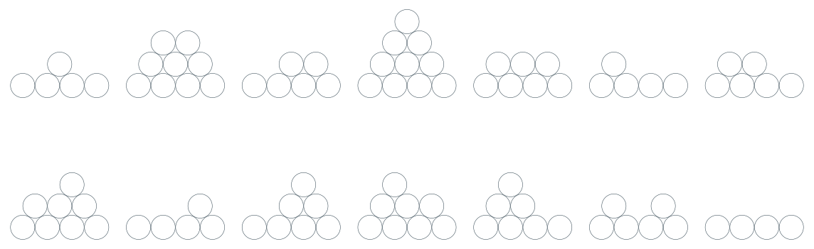

# Goals
- Implement a tool to convert between tree to other well-known (generalized) Catalan structures in ideally linear time. Common operations such as triangulation flip are to be supported for each type of structures.

- Accompanied with a visualizer tool that produces publication level of svg.

- Enumeration of well-known Catalan structures (including k-ary trees and r-dyck path).

---
# Galleries
Here shows the visualization for `catalan(4)` in each Catalan structure. There are 14 of them for each. 

For `catalan(5)`, please click [here](galleries/c5/README.md) (42 of them for each Catalan structure).









# For MacOS users
You will likely encounter this error below when attempting to do triangulation flip:
```
nextEventMatchingMask should only be called from the Main Thread!
```
It is because that the visualizer is not started on the main thread and apparently Apple does not allow that - read more about it [here](https://forums.developer.apple.com/forums/thread/659010).

---
# Milestones
### Generalized Catalan Tree generator
- [x] A verifiably random generator for full `k`-ary tree

### Tree
- [x] Visualizer for full `k`-ary trees
- [x] Gallery for $C_4$ and $C_5$ (for now)

### Dyck Path
- [x] Convert between `r`-dyck path *mirrored* pre-order bit string and tree in `O(n)`
- [x] Convert between `r`-dyck path pre-order bit string and tree in `O(nlog(n/r))`
- [x] Visualizer for `r`-dyck path
- [x] Verify a given path is a valid `r`-dyck path or not
- [ ] Flip mountain
- [x] Gallery for $C_4$ and $C_5$ (for now)

### Triangulation
- [x] Convert between polygon triangulation and binary tree in `O(n)`
- [x] Visualizer for polygon triangulation
- [x] Triangulation flip in `O(1)` with `O(n)` pre-processing and visualize the result
- [x] Verify a given polygon triangulation is a valid polygon triangulation or not
- [x] Gallery for $C_4$ and $C_5$ (for now)

### Non-intersecting Chord Graph
- [x] Convert between non-intersecting chord graph and binary tree in `O(n)`
- [x] Visualizer for non-intersecting chord graph
- [ ] Exchange a chord and visualize the result
- [ ] Verify a given chord graph is a valid non-intersecting chord graph or not
- [x] Gallery for $C_4$ and $C_5$ (for now)

### Non-crossing Arcs
- [x] Convert between non-crossing arcs and binary tree in `O(n)`
- [x] Visualizer for non-crossing arcs 
- [ ] Exchange an arc and visualize the result
- [ ] Verify a given arcs is a valid non-crossing arcs or not
- [x] Gallery for $C_4$ and $C_5$ (for now)

### Coin Stack
- [x] Visualizer for coin stack
- [x] Gallery for $C_4$ and $C_5$ (for now)

### Other
- [x] Output full `k`-ary tree as a file and read from it to recreate it
- [ ] A website that hosts all visualization for well-known Catalan structures for `n >= 3 to n < ?`.

### Organization
- [ ] Code base rewrite to follow OOP
- [ ] Documentation

---
# Compile Instruction
## Python Packages To Install
- `Networkx`
- `Matplotlib`
- `Pydot`
- `PyQt6`
- `Netgraph`
- `Watchdog`

## C++23
The `Makefile` uses `-std=c++23`, so make sure your `g++` compiler version supports it.

## Steps To Follow
- First create a Python venv named `visualizer` 
- Install all needed dependenceis listed way above
- Enter `make` into the terminal

## How to Update Python venv
```
python -m venv /path/to/new/virtual/environment
```

## RuntimeWarning: invalid value encountered in divide
Netgraph lib currently has this warning as discussed by the library creator [here](https://github.com/paulbrodersen/netgraph/issues/81); to suppress this harming warning, put
```
np.seterr(divide='ignore', invalid='ignore')
```
where the warning occurrs.

credit to this [post](https://stackoverflow.com/questions/14861891/runtimewarning-invalid-value-encountered-in-divide).

----
# Related Works
## Tree
### Height of Tree
- [The Average Height of Binary Trees and Other Simple Trees](https://algo.inria.fr/flajolet/Publications/FlOd82height.pdf)
- [ON THE HEIGHT OF TREES](https://www.cambridge.org/core/journals/journal-of-the-australian-mathematical-society/article/on-the-height-of-trees/C30DF2A9C26541526D847E0A0D46F2A8)
- [Variance of Height of Tree](https://math.stackexchange.com/questions/660698/variance-of-height-of-tree)
- [How to analyze this expected number of a random tree?](https://codeforces.com/blog/entry/95463)
### Tree Generation
- [Counting and Randomly Generating k-Ary Trees](https://www.scirp.org/pdf/am_2021122213413624.pdf)
- [Counting k-ary labelled trees](https://math.stackexchange.com/questions/145515/counting-k-ary-labelled-trees)
- [Prüfer Codes of Labeled Trees](https://demonstrations.wolfram.com/PruferCodesOfLabeledTrees/)
- [Prüfer Code](https://mathworld.wolfram.com/PrueferCode.html)
- [Prüfer Code](https://cp-algorithms.com/graph/pruefer_code.html)
### Tree Enumeration
- [Lexicographic Enumeration of k-ary Trees](https://www.tandfonline.com/doi/abs/10.1080/02522667.1985.10698815)
- [Efficient loopless generation of Gray codes for k-ary trees](https://www.sciencedirect.com/science/article/abs/pii/S0020019000001393)
- [Generating Binary Trees by Rotations](https://webhome.cs.uvic.ca/~ruskey/Publications/Rotation/Rotation.html)
- [The Greedy Gray Code Algorithm](https://link.springer.com/chapter/10.1007/978-3-642-40104-6_46)

### Pattern Avoiding Trees Enumeration
- [COMBINATORIAL GENERATION VIA PERMUTATION LANGUAGES. VI. BINARY TREES](https://arxiv.org/pdf/2306.08420)
- [The Combinatorial Object Server](http://www.combos.org/btree)

### Edge Flip Tree Graph has a Hamiltonian path and cycle 
- [The Rotation Graph of Binary Trees is Hamiltonian](https://www.cs.princeton.edu/techreports/1986/021.pdf)

## Dyck Paths
- [Raised k-Dyck Paths](https://cs.uwaterloo.ca/journals/JIS/VOL26/Drube/drube12.pdf)
- [On a generalisation of k-Dyck paths](https://scholar.sun.ac.za/server/api/core/bitstreams/1e3e820c-7bf3-4362-abe4-0684b1f94d0f/content)
- [COMBINATORICS OF r-DYCK PATHS, r-PARKING FUNCTIONS, AND THE r-TAMARI LATTICES](https://arxiv.org/pdf/1202.6269)

## Triangulation
- [Common edges in rooted trees and polygonal triangulations](https://personal.math.ubc.ca/~andrewr/pubs/triangulations.pdf)
- [Rotation Distance, Triangulations, and Hyperbolic Geometry](https://www.cs.cmu.edu/~sleator/papers/rotation-distance.pdf)
- [Convex polygon triangulation based on planted trivalent binary tree and ballot problem](https://www.researchgate.net/publication/330544850_Convex_polygon_triangulation_based_on_planted_trivalent_binary_tree_and_ballot_problem)
- [Graph of triangulations of a convex polygon and tree of triangulations](https://web.mat.upc.edu/marc.noy/uploads/2013/05/graph-triangulations.pdf)
- [Properties of Random Triangulations and Trees](https://www.researchgate.net/publication/220453462_Properties_of_Random_Triangulations_and_Trees)

## Catalan Structures
- Richard P. Stanley - Catalan Numbers-Cambridge University Press (2015)
- [Information on Enumerative Combinatorics](https://math.mit.edu/~rstan/ec/)
- [Bijection Between Catalan Objects](https://www.math.unl.edu/~tlai3/Catalan%20Objects.pdf)
- [Catalan Numbers](http://www.geometer.org/mathcircles/catalan.pdf)
- [CATALAN NUMBERS](https://pi.math.cornell.edu/~karola/dimex/catalan.pdf)
- [Catalan Numbers, Their Generalization, and Their Uses](https://www.math.uakron.edu/~cossey/636papers/hilton%20and%20pedersen.pdf)

## Super Catalan
- [Elements of the sets enumerated by super-Catalan numbers](https://math.haifa.ac.il/toufik/enumerative/supercat.pdf)

## Mixing Time
- [On the Mixing Time of the Triangulation Walk and other Catalan Structures](https://tetali.math.gatech.edu/PUBLIS/mt.pdf)
- [Improved Mixing for the Convex Polygon Triangulation Flip Walk](https://drops.dagstuhl.de/entities/document/10.4230/LIPIcs.ICALP.2023.56)
- [Polynomial mixing time of edge flips on quadrangulations](https://arxiv.org/abs/1809.05092)

## Other
- [A Transformation of the Catalan Numbers and Related Counted Sets](https://shareok.org/bitstream/handle/11244/323386/Davis_okstate_0664M_16189.pdf?sequence=1&isAllowed=y)
- [AN ENUMERATIVE-PROBABILISTIC STUDY OF CHORD DIAGRAMS](https://etd.ohiolink.edu/acprod/odb_etd/ws/send_file/send?accession=osu1373310487&disposition=inline)
